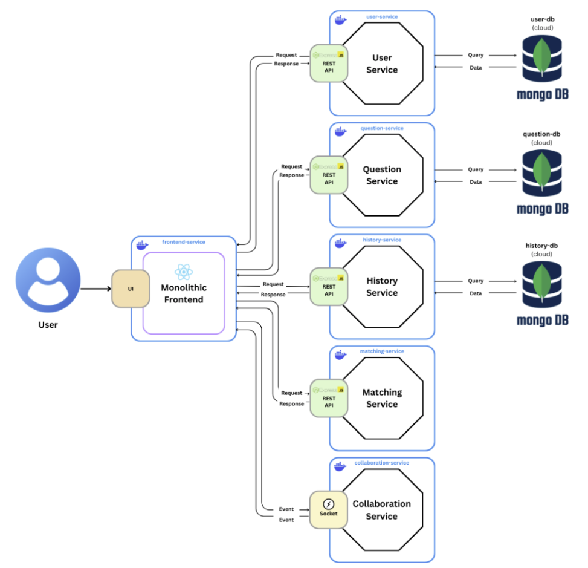

[](https://classroom.github.com/a/bzPrOe11)

# CS3219 Project (PeerPrep) - AY2425S1

## Group: G34
PeerPrep is a web application aimed to help students prepare for technical whiteboard interviews through peer-to-peer practice in a collaborative space.

## Table of Contents
- [Table of Contents](#table-of-contents)
- [Architecture Overview](#architecture-overview)
- [Project Setup](#project-setup)
  - [Prerequisites](#prerequisites)
  - [Instructions](#instructions)

## Architecture Overview
PeerPrep's architecture combines a scalable, microservices-based backend with a monolithic frontend, allowing for flexible backend operations and simpler frontend maintenance. Its backend is developed with Node.js and Express, while the frontend is built using React.js.



## Project Setup

In this section, you will set up PeerPrep to run locally.

### Prerequisites
1. [Docker](https://docs.docker.com/get-docker/) installed on your machine
2. [docker-compose](https://docs.docker.com/compose/install/) installed

### Instructions
1. Clone this repository into your local machine.
2. Configure `.env` files as required.
3. Navigate to the root directory of this repository (where `docker-compose.yaml` is located).
4. Run `docker-compose` to build and run all the services.

    ``` bash
    docker-compose up --build
    ```
5. Once started, open up your browser and go to http://localhost:3000/ to access PeerPrep.
