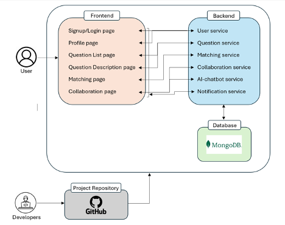

# CS3219 Project (PeerPrep) - AY2425S1

## Group: G09

This document outlines the architecture of this diagram and includes some basic instructions for running the application on your machine.

## Architecture Overview

Peerprep consists of a ReactJS frontend that is linked to multiple backend services developed using Frameworks like Express and Flask.

### Frontend

The frontend for this application is developed using ReactJS, a simple JavaScript based web framework. The routing between different pages in the application is handled by the react-router-dom library and the routes are kept simple and intuitive.

In order to communicate with the multiple backend services smoothly, we used the HTTP client Axios to make HTTP requests to each of the backend services. Data retrieved from the backend services is stored and managed using React’s state management (useState, useEffect). Additionally, we also ensure secure communication by specifying the frontend address when configuring Cross Origin Resource Sharing (CORS) in each of the backend services.

### Collaboration service

The collaboration-service is a backend service designed to facilitate real-time collaboration between users. It uses sockets and socket wrappers from SocketIo and yjs libraries, to enable features such as joining rooms, concurrent editing, sending messages, and notifying users when a partner leaves.

Additionally, this service also helps users save data about their attempts, for future reference. This service is built using Node.js and Express, and it interacts with a MongoDB database through Mongoose models to store objects that describe the attempts made by each user in a collaboration session. This service utilizes REST API calls. As this service is utilized by a few frontend pages (User’s collaboration history, Collaboration page), REST APIs are well-defined for different use cases.

### Matching service

The matching-service is designed to facilitate the process of pairing users based on shared preferences, such as topic and difficulty level, within a larger system. It uses a combination of Flask for the web service framework, RabbitMQ for message queuing, and Socket.IO for real-time communication. The architecture of the matching-service is designed to efficiently handle user match requests in a scalable and reliable manner.

### Notification service

The notification service is implemented using Flask-SocketIO, a Flask extension that enables real-time bidirectional communication between the server and clients using WebSocket connections. This service acts as a bridge between the matching service and the Frontend application.

### Question service

The question-service is a backend service designed to manage a collection of questions in a database. It provides RESTful API endpoints for creating, retrieving, and managing questions. The service is built using Node.js and Express, and it interacts with a MongoDB database through Mongoose models. The Question Service also uses an MVC pattern as it involves retrieval of data from a database.

### User service

The User Service is a backend service that handles data pertaining to the user. It handles functions such as registering, logging in, authentication and more. The User Service has an Express backend which is connected to MongoDB. It can receive REST API HTTP calls from the frontend and get/post relevant data to/from the database.

## Instructions to run this app

To run peerprep, follow these steps:

1. Clone this repo into your local machine.
2. `cd` into the root directory
3. Add in .env files
4. Run the command `docker compose up --build -d`
5. View the application at `localhost:3000`

### Note:

- You can choose to develop individual microservices within separate folders within this repository **OR** use individual repositories (all public) for each microservice.
- In the latter scenario, you should enable sub-modules on this GitHub classroom repository to manage the development/deployment **AND** add your mentor to the individual repositories as a collaborator.
- The teaching team should be given access to the repositories as we may require viewing the history of the repository in case of any disputes or disagreements.
