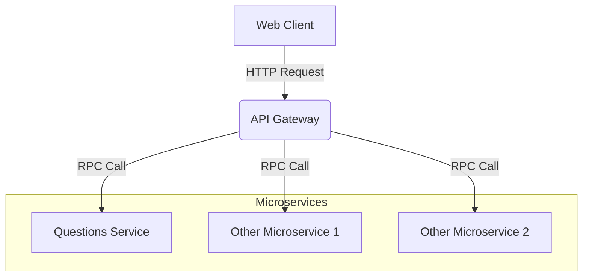

# Project

This Turborepo includes a Next.js frontend, a NestJS API gateway, and NestJS microservices, using shadcn/ui for CSS and Zod for validation.

## Layout

This Turborepo includes the following packages/apps:

### Apps

- `web`: [Next.js](https://nextjs.org/) app for the frontend
- `api-gateway`: [NestJS](https://nestjs.com/) backend serving as an entry point into microservices
- `questions-service`: [NestJS](https://nestjs.com/) backend handling all questions related functions



### Packages

- `@repo/eslint-config`: `eslint` configurations (includes `eslint-config-next` and `eslint-config-prettier`)
- `@repo/typescript-config`: `tsconfig.json`s used throughout the monorepo
- `@repo/dtos`: Shared DTOs and Zod schemas
- `@repo/pipes`: Shared NestJS pipes

Each package/app is 100% [TypeScript](https://www.typescriptlang.org/).

### Utilities

- [TypeScript](https://www.typescriptlang.org/) for static type checking
- [ESLint](https://eslint.org/) for code linting
- [Prettier](https://prettier.io) for code formatting
- [TurboRepo](https://turbo.build/repo/docs) for easily managing monorepo
- [shadcn/ui](https://ui.shadcn.com/) for CSS
- [Zod](https://zod.dev/) for validation
- [TanStack Query](https://tanstack.com/query/latest/docs/framework/react/overview) for querying

## Getting Started

### Build

To build all apps and packages, run the following command:

```
pnpm build
```

### Setup Environment Variables

Each `project/apps` has a `.env` that you should create.
Copy the `.env.example` file in each of these apps to create a new `.env` file:

```bash
$ cp .env.example .env
```

Then, replace the variables accordingly.

### Develop

To develop all apps and packages, run the following command:

```
pnpm install
pnpm dev
```

## Development Guide

### Frontend Development

The frontend is located in `apps/web`. This is a Next.js application where you'll develop your user interface.

### Creating a New Microservice

To create a new microservice:

1. Navigate to the `apps` directory
2. Run the following command:
   ```
   nest new {service} --strict --skip-git --package-manager=pnpm
   ```
   Replace `{service}` with the name of your new microservice.

### Integrating a New Microservice

After creating a new microservice, you need to integrate it with the API gateway:

1. Register the microservice client in `api-gateway/src/api-gateway-module.ts`
2. Create a new controller within `api-gateway/src/{service}` which redirects requests to the microservice. You can follow the format of `api-gateway/src/questions/questions.controller.ts`

### Shared Packages

- `packages/dtos`: This is where we define our schemas and DTOs using Zod. These can be shared across the frontend and backend, and are used for validation pipes on the backend.
- `packages/pipes`: This is where we store pipes to be shared across NestJS apps.

### Using Shared Packages

To use packages in other packages or apps:

1. Add the package name (found in that package's `package.json`) to the `package.json` of your target app or package.
2. You can then import it in your code.

### Validation

We use Zod for validation across the project. Define your schemas in `packages/dtos`, and use them for both frontend and backend validation.

### Styling

We use shadcn/ui for CSS. Refer to the [shadcn/ui documentation](https://ui.shadcn.com/) for usage instructions.

## Best Practices

- Keep your microservices small and focused on a specific domain.
- Use the shared DTOs for consistency between frontend and backend.
- Write unit tests for your services and controllers.
- Use Zod schemas for both runtime validation and TypeScript type inference.

## Troubleshooting

If you encounter any issues:

1. Ensure all dependencies are installed with `pnpm install`
2. Check that you're using the correct Node.js version (specified in `.nvmrc`)
3. Clear your build cache with `pnpm clean`
4. If problems persist, please open an issue in the repository
